# 🏗️ Architecture DodoLens

Documentation détaillée de l'architecture du calculateur de volume révolutionnaire DodoLens.

## 📋 Table des matières

- [Vue d'ensemble](#vue-densemble)
- [Architecture Frontend](#architecture-frontend)
- [Architecture Backend](#architecture-backend)
- [Intégrations IA](#intégrations-ia)
- [Communication Inter-Services](#communication-inter-services)
- [Sécurité](#sécurité)
- [Performance](#performance)
- [Déploiement](#déploiement)

## 🌟 Vue d'ensemble

DodoLens est une application Next.js 14 qui révolutionne l'estimation de volume de déménagement en utilisant la vidéo mobile et l'intelligence artificielle. L'architecture est conçue pour s'intégrer parfaitement dans l'écosystème Dodomove existant.

### 🎯 Principes architecturaux

1. **Mobile-First** : Interface optimisée pour smartphones
2. **IA-Driven** : Intelligence artificielle au cœur du processus
3. **Modulaire** : Composants réutilisables et maintenables
4. **Performant** : Optimisations pour la vidéo et le temps réel
5. **Intégré** : Communication seamless avec l'écosystème Dodomove

### 🔄 Flux principal

```mermaid
graph TD
    A[📱 Interface Mobile] --> B[🎬 Enregistrement Vidéo]
    B --> C[🎙️ Reconnaissance Vocale]
    C --> D[📊 Analyse temps réel]
    D --> E[🤖 OpenAI Vision API]
    E --> F[📋 Génération tableau]
    F --> G[✏️ Édition utilisateur]
    G --> H[🧮 Calcul volume]
    H --> I[📤 Backend centralisé]
    I --> J[💾 Sauvegarde Airtable]
    I --> K[📧 Email résultats]
```



## 🖥️ Architecture Frontend

### 📦 Structure des composants

```
src/
├── components/
│   ├── video/              # Composants vidéo
│   │   ├── VideoRecorder   # Interface enregistrement principal
│   │   ├── VideoControls   # Contrôles pause/play/stop
│   │   ├── VideoPreview    # Aperçu temps réel
│   │   └── VideoSegments   # Gestion multi-vidéos
│   ├── audio/              # Composants audio
│   │   ├── SpeechRecognition # Web Speech API
│   │   ├── AudioTranscript   # Affichage transcript
│   │   └── VoiceCommands     # Commandes vocales
│   ├── ai/                 # Composants IA
│   │   ├── VideoAnalyzer   # Interface analyse
│   │   ├── ObjectDetector  # Détection objets
│   │   └── ConfidenceScore # Score de confiance
│   └── editing/            # Composants édition
│       ├── ItemsTable      # Tableau objets
│       ├── EditableItem    # Item éditable
│       └── VolumeCalculator # Calcul volume
```

### 🗄️ Gestion d'état avec Zustand

#### VideoStore
```typescript
interface VideoStore {
  // État de l'enregistrement
  isRecording: boolean;
  isPaused: boolean;
  currentSegment: number;
  segments: VideoSegment[];
  
  // Métadonnées
  totalDuration: number;
  quality: VideoQuality;
  
  // Actions
  startRecording: () => void;
  pauseRecording: () => void;
  stopRecording: () => void;
  addSegment: (segment: VideoSegment) => void;
}
```

#### AudioStore
```typescript
interface AudioStore {
  // État de la reconnaissance vocale
  isListening: boolean;
  transcript: string;
  confidence: number;
  
  // Commandes détectées
  commands: VoiceCommand[];
  intentions: UserIntention[];
  
  // Actions
  startListening: () => void;
  stopListening: () => void;
  processTranscript: (text: string) => void;
}
```

#### ItemsStore
```typescript
interface ItemsStore {
  // Objets détectés
  items: DetectedItem[];
  totalVolume: number;
  confidence: number;
  
  // État d'édition
  editingItem: string | null;
  
  // Actions
  addItem: (item: DetectedItem) => void;
  updateItem: (id: string, updates: Partial<DetectedItem>) => void;
  deleteItem: (id: string) => void;
  calculateTotalVolume: () => number;
}
```

### 🎨 Design System

#### Couleurs
```css
/* Couleurs principales Dodomove */
--dodomove-blue: 213 94% 68%;
--dodomove-orange: 9 91% 69%;

/* États vidéo */
--recording-color: 239 68 68;   /* Rouge enregistrement */
--processing-color: 59 130 246; /* Bleu traitement */
--success-color: 34 197 94;     /* Vert succès */
```

#### Typographie
```css
/* Polices cohérentes */
font-family: 'Lato', sans-serif;           /* Corps de texte */
font-family: 'Roboto Slab', serif;        /* Titres */
```

#### Animations
```css
/* Animations spécialisées */
@keyframes recording {
  0%, 100% { opacity: 1; transform: scale(1); }
  50% { opacity: 0.7; transform: scale(1.05); }
}

@keyframes boat-float {
  0%, 100% { transform: translateY(0px) rotate(0deg); }
  50% { transform: translateY(-10px) rotate(1deg); }
}
```

## 🏭 Architecture Backend

### 🛠️ Extension du backend centralisé

DodoLens étend le backend Dodomove existant avec de nouvelles routes spécialisées :

```javascript
// Routes DodoLens dans dodomove-backend
app.post('/api/dodo-lens/start-session', startSessionHandler);
app.post('/api/dodo-lens/process-video', processVideoHandler);
app.post('/api/dodo-lens/finalize', finalizeHandler);
app.get('/api/dodo-lens/session/:id', getSessionHandler);
app.delete('/api/dodo-lens/session/:id', deleteSessionHandler);
```

### 📊 Structure des données

#### Session vidéo
```typescript
interface VideoSession {
  id: string;
  userId?: string;
  createdAt: Date;
  updatedAt: Date;
  status: 'active' | 'processing' | 'completed' | 'expired';
  
  // Métadonnées
  totalVideos: number;
  totalDuration: number;
  totalVolume?: number;
  confidence?: number;
  
  // Données
  videos: VideoSegment[];
  items: DetectedItem[];
  
  // Intégration
  funnelSessionId?: string;
  emailSent?: boolean;
}
```

#### Objet détecté
```typescript
interface DetectedItem {
  id: string;
  name: string;
  category: string;
  quantity: number;
  volume: number;
  
  // Métadonnées IA
  confidence: number;
  detectionMethod: 'video' | 'audio' | 'manual';
  videoTimestamp?: number;
  audioMention?: string;
  
  // État d'édition
  isEdited: boolean;
  originalData?: Partial<DetectedItem>;
}
```

### 🗄️ Stockage Airtable

#### Table "DodoLens Sessions"
```javascript
const airtableSchema = {
  'Session ID': 'Single line text',
  'Items JSON': 'Long text',
  'Total Volume': 'Number',
  'Confidence Score': 'Percent',
  'Video Count': 'Number',
  'Processing Time': 'Duration',
  'User Email': 'Email',
  'Funnel Integration': 'Checkbox',
  'Created At': 'Date and time',
  'Status': 'Single select',
  'Notes': 'Long text'
};
```

## 🤖 Intégrations IA

### 👁️ OpenAI Vision API

#### Analyse de frames vidéo
```typescript
const analyzeVideoFrame = async (frameData: string): Promise<DetectedItem[]> => {
  const response = await openai.chat.completions.create({
    model: "gpt-4-vision-preview",
    messages: [{
      role: "user",
      content: [
        {
          type: "text",
          text: `Analyse cette image d'intérieur pour un déménagement.
          Identifie tous les meubles et objets visibles.
          
          Retourne un JSON avec pour chaque objet:
          - name: nom en français
          - quantity: nombre d'exemplaires
          - volume: volume estimé en m³
          - category: catégorie (salon, cuisine, etc.)
          - confidence: niveau de confiance (0-1)`
        },
        {
          type: "image_url",
          image_url: { url: `data:image/jpeg;base64,${frameData}` }
        }
      ]
    }],
    max_tokens: 1000
  });
  
  return parseAIResponse(response.choices[0].message.content);
};
```

#### Optimisations performance
```typescript
// Cache des analyses pour éviter les appels redondants
const aiCache = new Map<string, AIResult>();

// Compression des images avant envoi
const compressFrame = (canvas: HTMLCanvasElement): string => {
  const context = canvas.getContext('2d');
  canvas.width = 640;  // Résolution optimale
  canvas.height = 360;
  
  return canvas.toDataURL('image/jpeg', 0.8);
};

// Extraction de frames intelligente
const extractKeyFrames = (video: HTMLVideoElement): string[] => {
  // Extraire 1 frame toutes les 2 secondes
  // Éviter les frames floues ou sombres
  // Détecter les changements de scène
};
```

### 🎙️ Reconnaissance Vocale

#### Web Speech API (principal)
```typescript
const setupSpeechRecognition = (): SpeechRecognition => {
  const recognition = new (window.SpeechRecognition || window.webkitSpeechRecognition)();
  
  recognition.continuous = true;
  recognition.interimResults = true;
  recognition.lang = 'fr-FR';
  recognition.maxAlternatives = 3;
  
  recognition.onresult = (event) => {
    const result = event.results[event.resultIndex];
    const transcript = result[0].transcript;
    const confidence = result[0].confidence;
    
    processVoiceCommand(transcript, confidence);
  };
  
  return recognition;
};
```

#### OpenAI Whisper (fallback)
```typescript
const transcribeWithWhisper = async (audioBlob: Blob): Promise<string> => {
  const formData = new FormData();
  formData.append('file', audioBlob, 'audio.webm');
  formData.append('model', 'whisper-1');
  formData.append('language', 'fr');
  formData.append('prompt', 'Transcription de commentaires sur un déménagement avec meubles et objets.');
  
  const response = await openai.audio.transcriptions.create(formData);
  return response.text;
};
```

### 🧠 Algorithme de fusion

#### Combinaison vidéo + audio
```typescript
const combineVideoAndAudio = (
  videoObjects: VideoObject[],
  audioTranscript: string
): DetectedItem[] => {
  // 1. Analyser le transcript pour extraire les intentions
  const intentions = extractUserIntentions(audioTranscript);
  
  // 2. Matcher les objets vidéo avec les mentions audio
  const matchedObjects = matchObjectsWithMentions(videoObjects, intentions);
  
  // 3. Résoudre les conflits et ambiguïtés
  const resolvedObjects = resolveConflicts(matchedObjects);
  
  // 4. Calculer les scores de confiance finaux
  return calculateFinalConfidence(resolvedObjects);
};

const extractUserIntentions = (transcript: string): UserIntention[] => {
  const patterns = {
    // Intentions positives
    take: /(?:je (?:prends|garde|emporte)|ça part|à déménager|celui-là oui)/gi,
    
    // Intentions négatives  
    leave: /(?:je (?:laisse|garde pas)|ça reste|pas celui-là|ignore)/gi,
    
    // Quantificateurs
    all: /(?:tous?|toutes?|l'ensemble|la totalité)/gi,
    some: /(?:quelques|certains|une partie)/gi,
    
    // Références objets
    furniture: /(?:ce|cette|cet)\s+(canapé|table|armoire|lit|chaise)/gi,
    boxes: /(?:ces|tous ces)\s+cartons?/gi
  };
  
  // Extraire et structurer les intentions
  return parseIntentions(transcript, patterns);
};
```

## 🔗 Communication Inter-Services

### 📡 PostMessage avec le funnel

#### Communication bidirectionnelle
```typescript
// DodoLens → Funnel : Résultats calculés
const sendResultsToFunnel = (results: CalculationResults) => {
  window.parent.postMessage({
    type: 'DODO_LENS_RESULT',
    payload: {
      sessionId: results.sessionId,
      items: results.items,
      totalVolume: results.totalVolume,
      confidence: results.confidence,
      processingTime: results.processingTime,
      videoCount: results.videoCount
    }
  }, 'https://devis.dodomove.fr');
};

// Funnel → DodoLens : Données existantes
window.addEventListener('message', (event) => {
  if (event.origin !== 'https://devis.dodomove.fr') return;
  
  if (event.data.type === 'LOAD_EXISTING_DATA') {
    const { items, totalVolume } = event.data.payload;
    loadExistingCalculation(items, totalVolume);
  }
});
```

#### Gestion des erreurs
```typescript
const handleCommunicationError = (error: Error) => {
  // Log l'erreur
  console.error('Erreur communication PostMessage:', error);
  
  // Fallback : sauvegarder en local
  saveCalculationLocally();
  
  // Notifier l'utilisateur
  showErrorToast('Une erreur est survenue. Vos données sont sauvegardées.');
  
  // Retry automatique
  setTimeout(() => {
    retryPostMessage();
  }, 2000);
};
```

### 🌐 APIs Backend

#### Configuration fetch intelligente
```typescript
const apiFetch = async (endpoint: string, options: RequestInit = {}) => {
  const baseURL = process.env.NEXT_PUBLIC_BACKEND_URL;
  const url = `${baseURL}/api/dodo-lens${endpoint}`;
  
  const defaultOptions: RequestInit = {
    headers: {
      'Content-Type': 'application/json',
      'X-App-Version': process.env.NEXT_PUBLIC_APP_VERSION || '1.0.0',
      'X-Session-ID': getSessionId(),
    },
    ...options
  };
  
  try {
    const response = await fetch(url, defaultOptions);
    
    if (!response.ok) {
      throw new Error(`HTTP ${response.status}: ${response.statusText}`);
    }
    
    return await response.json();
  } catch (error) {
    handleAPIError(error);
    throw error;
  }
};
```

#### Retry et fallback
```typescript
const apiWithRetry = async (endpoint: string, options: RequestInit, maxRetries = 3) => {
  for (let attempt = 1; attempt <= maxRetries; attempt++) {
    try {
      return await apiFetch(endpoint, options);
    } catch (error) {
      if (attempt === maxRetries) {
        // Dernier essai échoué, fallback local
        return handleAPIFallback(endpoint, options);
      }
      
      // Attendre avant le prochain essai (exponential backoff)
      await new Promise(resolve => setTimeout(resolve, 1000 * Math.pow(2, attempt - 1)));
    }
  }
};
```

## 🔒 Sécurité

### 🛡️ Authentification et autorisation

#### Gestion des sessions
```typescript
interface SecureSession {
  sessionId: string;
  userId?: string;
  createdAt: Date;
  expiresAt: Date;
  permissions: Permission[];
  rateLimit: RateLimitInfo;
}

const createSecureSession = (): SecureSession => {
  return {
    sessionId: generateSecureToken(),
    createdAt: new Date(),
    expiresAt: new Date(Date.now() + 24 * 60 * 60 * 1000), // 24h
    permissions: ['video:record', 'ai:analyze', 'data:edit'],
    rateLimit: {
      maxRequests: 100,
      window: '1h',
      current: 0
    }
  };
};
```

#### Rate limiting
```typescript
const rateLimiter = {
  video: { max: 10, window: '1h' },      // 10 vidéos/heure
  aiAnalysis: { max: 50, window: '1h' }, // 50 analyses/heure
  apiCalls: { max: 200, window: '1h' }   // 200 appels API/heure
};

const checkRateLimit = (action: string, sessionId: string): boolean => {
  const limit = rateLimiter[action];
  const currentUsage = getCurrentUsage(sessionId, action);
  
  return currentUsage < limit.max;
};
```

### 🔐 Protection des données

#### Chiffrement des données sensibles
```typescript
const encryptSensitiveData = (data: any): string => {
  const key = process.env.ENCRYPTION_KEY;
  const iv = crypto.randomBytes(16);
  const cipher = crypto.createCipher('aes-256-gcm', key);
  
  let encrypted = cipher.update(JSON.stringify(data), 'utf8', 'hex');
  encrypted += cipher.final('hex');
  
  return `${iv.toString('hex')}:${encrypted}`;
};
```

#### Validation des données
```typescript
const validateVideoData = (data: VideoData): ValidationResult => {
  const errors: string[] = [];
  
  // Vérifier la taille
  if (data.size > MAX_VIDEO_SIZE) {
    errors.push('Vidéo trop volumineuse');
  }
  
  // Vérifier le format
  if (!ALLOWED_VIDEO_FORMATS.includes(data.type)) {
    errors.push('Format vidéo non supporté');
  }
  
  // Vérifier la durée
  if (data.duration > MAX_VIDEO_DURATION) {
    errors.push('Vidéo trop longue');
  }
  
  return {
    isValid: errors.length === 0,
    errors
  };
};
```

### 🌐 Sécurité réseau

#### Headers de sécurité
```typescript
const securityHeaders = {
  'Strict-Transport-Security': 'max-age=31536000; includeSubDomains',
  'X-Content-Type-Options': 'nosniff',
  'X-Frame-Options': 'SAMEORIGIN',
  'X-XSS-Protection': '1; mode=block',
  'Referrer-Policy': 'strict-origin-when-cross-origin',
  'Permissions-Policy': 'camera=(self), microphone=(self), geolocation=()'
};
```

#### CORS configuré
```typescript
const corsConfig = {
  origin: [
    'https://devis.dodomove.fr',
    'https://partage.dodomove.fr',
    'https://dodomove.fr',
    ...(process.env.NODE_ENV === 'development' ? ['http://localhost:3000'] : [])
  ],
  methods: ['GET', 'POST', 'PUT', 'DELETE', 'OPTIONS'],
  allowedHeaders: ['Content-Type', 'Authorization', 'X-Requested-With'],
  credentials: true
};
```

## ⚡ Performance

### 🎬 Optimisations vidéo

#### Compression en temps réel
```typescript
const optimizeVideoForAI = (videoBlob: Blob): Promise<Blob> => {
  return new Promise((resolve) => {
    const video = document.createElement('video');
    const canvas = document.createElement('canvas');
    const context = canvas.getContext('2d');
    
    video.onloadedmetadata = () => {
      // Réduire la résolution pour l'IA
      canvas.width = Math.min(video.videoWidth, 640);
      canvas.height = Math.min(video.videoHeight, 360);
      
      context.drawImage(video, 0, 0, canvas.width, canvas.height);
      
      canvas.toBlob((optimizedBlob) => {
        resolve(optimizedBlob);
      }, 'video/webm', 0.8);
    };
    
    video.src = URL.createObjectURL(videoBlob);
  });
};
```

#### Streaming et chunks
```typescript
const processVideoInChunks = async (videoBlob: Blob, chunkSize = 5000) => {
  const chunks: Blob[] = [];
  let offset = 0;
  
  while (offset < videoBlob.size) {
    const chunk = videoBlob.slice(offset, offset + chunkSize);
    chunks.push(chunk);
    offset += chunkSize;
  }
  
  // Traiter les chunks en parallèle
  const results = await Promise.all(
    chunks.map(chunk => processVideoChunk(chunk))
  );
  
  return combineChunkResults(results);
};
```

### 🧠 Optimisations IA

#### Cache intelligent
```typescript
class AICache {
  private cache = new Map<string, CachedResult>();
  private maxSize = 1000;
  private ttl = 24 * 60 * 60 * 1000; // 24h
  
  set(key: string, value: any): void {
    // Vérifier la taille du cache
    if (this.cache.size >= this.maxSize) {
      this.cleanup();
    }
    
    this.cache.set(key, {
      value,
      timestamp: Date.now(),
      hits: 0
    });
  }
  
  get(key: string): any | null {
    const cached = this.cache.get(key);
    
    if (!cached) return null;
    
    // Vérifier la validité
    if (Date.now() - cached.timestamp > this.ttl) {
      this.cache.delete(key);
      return null;
    }
    
    cached.hits++;
    return cached.value;
  }
  
  private cleanup(): void {
    // Supprimer les entrées les moins utilisées
    const entries = Array.from(this.cache.entries())
      .sort((a, b) => a[1].hits - b[1].hits);
    
    const toDelete = entries.slice(0, Math.floor(this.maxSize * 0.2));
    toDelete.forEach(([key]) => this.cache.delete(key));
  }
}
```

#### Batch processing
```typescript
const batchAIRequests = async (frames: string[]): Promise<AIResult[]> => {
  const batchSize = 5;
  const batches: string[][] = [];
  
  for (let i = 0; i < frames.length; i += batchSize) {
    batches.push(frames.slice(i, i + batchSize));
  }
  
  const results = await Promise.all(
    batches.map(batch => processFrameBatch(batch))
  );
  
  return results.flat();
};
```

### 📱 Optimisations mobile

#### Lazy loading des composants
```typescript
const VideoRecorder = lazy(() => import('@/components/video/VideoRecorder'));
const AIAnalyzer = lazy(() => import('@/components/ai/AIAnalyzer'));

const DynamicVideoInterface = () => {
  return (
    <Suspense fallback={<LoadingSpinner />}>
      <VideoRecorder />
      <AIAnalyzer />
    </Suspense>
  );
};
```

#### Service Worker pour le cache
```typescript
// sw.js
self.addEventListener('fetch', (event) => {
  // Cache les ressources statiques
  if (event.request.url.includes('/static/')) {
    event.respondWith(
      caches.match(event.request).then(response => {
        return response || fetch(event.request);
      })
    );
  }
  
  // Stratégie réseau d'abord pour les APIs
  if (event.request.url.includes('/api/')) {
    event.respondWith(
      fetch(event.request).catch(() => {
        return caches.match(event.request);
      })
    );
  }
});
```

## 🚀 Déploiement

### 🌐 Environnements

#### Configuration multi-environnement
```typescript
const config = {
  development: {
    apiUrl: 'http://localhost:8080',
    openaiApiKey: process.env.OPENAI_API_KEY_DEV,
    debugMode: true,
    mockAI: true
  },
  staging: {
    apiUrl: 'https://staging-backend.dodomove.fr',
    openaiApiKey: process.env.OPENAI_API_KEY_STAGING,
    debugMode: true,
    mockAI: false
  },
  production: {
    apiUrl: 'https://web-production-7b738.up.railway.app',
    openaiApiKey: process.env.OPENAI_API_KEY_PROD,
    debugMode: false,
    mockAI: false
  }
};
```

### 📊 Monitoring et observabilité

#### Métriques personnalisées
```typescript
const metrics = {
  // Métriques vidéo
  videoRecordingDuration: histogram('video_recording_duration_seconds'),
  videoFileSize: histogram('video_file_size_bytes'),
  videoProcessingTime: histogram('video_processing_time_seconds'),
  
  // Métriques IA
  aiAnalysisTime: histogram('ai_analysis_time_seconds'),
  aiConfidenceScore: histogram('ai_confidence_score'),
  aiCacheHitRate: gauge('ai_cache_hit_rate'),
  
  // Métriques business
  sessionsStarted: counter('sessions_started_total'),
  sessionsCompleted: counter('sessions_completed_total'),
  itemsDetected: counter('items_detected_total'),
  volumeCalculated: histogram('volume_calculated_cubic_meters')
};
```

#### Logs structurés
```typescript
const logger = {
  info: (message: string, context: any = {}) => {
    console.log(JSON.stringify({
      level: 'info',
      timestamp: new Date().toISOString(),
      message,
      service: 'dodo-lens',
      ...context
    }));
  },
  
  error: (message: string, error: Error, context: any = {}) => {
    console.error(JSON.stringify({
      level: 'error',
      timestamp: new Date().toISOString(),
      message,
      error: {
        name: error.name,
        message: error.message,
        stack: error.stack
      },
      service: 'dodo-lens',
      ...context
    }));
  }
};
```

### 🔄 CI/CD Pipeline

#### GitHub Actions
```yaml
name: Deploy DodoLens

on:
  push:
    branches: [main, develop]
  pull_request:
    branches: [main]

jobs:
  test:
    runs-on: ubuntu-latest
    steps:
      - uses: actions/checkout@v3
      
      - name: Setup Node.js
        uses: actions/setup-node@v3
        with:
          node-version: '18'
          cache: 'npm'
      
      - name: Install dependencies
        run: npm ci
      
      - name: Run tests
        run: npm test
      
      - name: Test video APIs
        run: npm run test:video-api
      
      - name: Test AI integration
        run: npm run test:openai
        env:
          OPENAI_API_KEY: ${{ secrets.OPENAI_API_KEY_TEST }}
  
  deploy:
    needs: test
    runs-on: ubuntu-latest
    if: github.ref == 'refs/heads/main'
    
    steps:
      - uses: actions/checkout@v3
      
      - name: Deploy to Vercel
        uses: amondnet/vercel-action@v20
        with:
          vercel-token: ${{ secrets.VERCEL_TOKEN }}
          vercel-org-id: ${{ secrets.VERCEL_ORG_ID }}
          vercel-project-id: ${{ secrets.VERCEL_PROJECT_ID }}
      
      - name: Update Cloudflare DNS
        run: |
          curl -X PUT "https://api.cloudflare.com/client/v4/zones/${{ secrets.CLOUDFLARE_ZONE_ID }}/dns_records/${{ secrets.CLOUDFLARE_RECORD_ID }}" \
               -H "Authorization: Bearer ${{ secrets.CLOUDFLARE_API_TOKEN }}" \
               -H "Content-Type: application/json" \
               --data '{"content":"dodo-lens.vercel.app"}'
      
      - name: Notify team
        run: |
          curl -X POST ${{ secrets.SLACK_WEBHOOK_URL }} \
               -H 'Content-type: application/json' \
               --data '{"text":"🎬 DodoLens déployé en production avec succès!"}'
```

Cette architecture garantit une application performante, sécurisée et parfaitement intégrée dans l'écosystème Dodomove. La modularité permet une maintenance aisée et des évolutions futures fluides.
