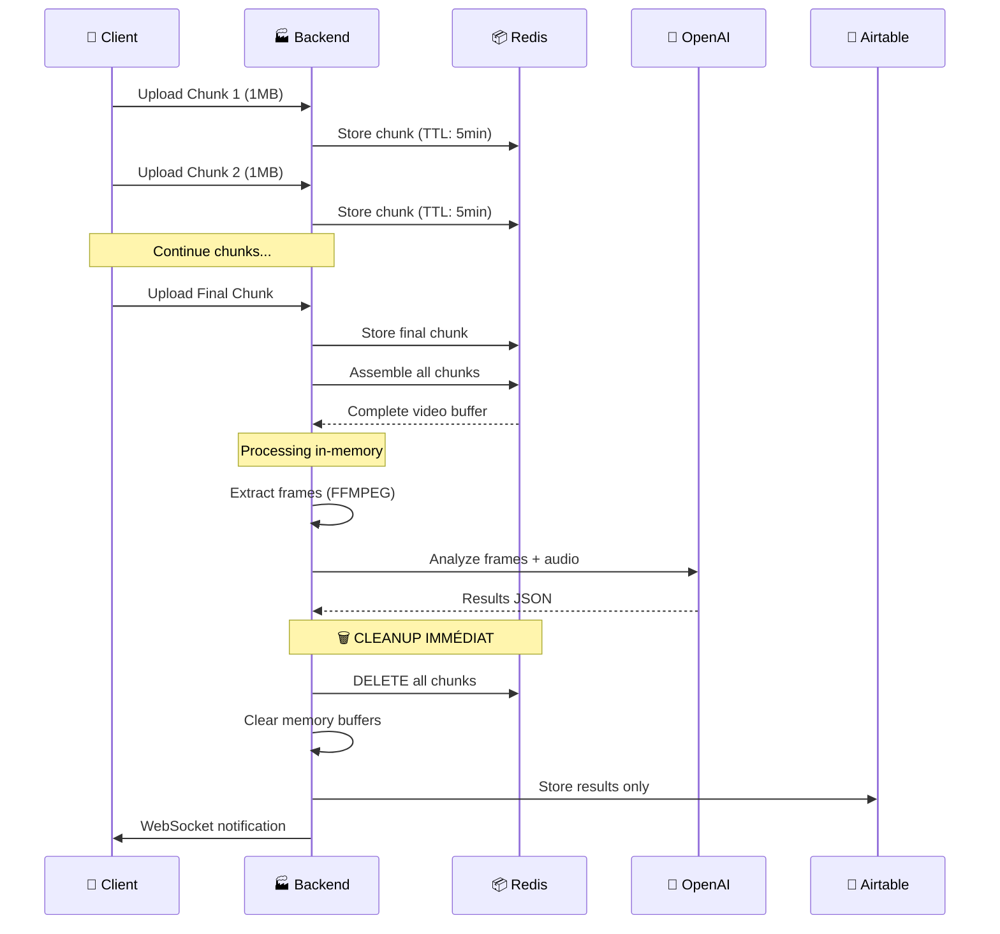

# Architecture Éphémère DodoLens

## 🎯 Vue d'ensemble

DodoLens utilise une **architecture éphémère révolutionnaire** qui élimine tout stockage de données sensibles (vidéos, audio, images) tout en offrant des performances optimales et une compliance RGPD native.

## 🏗️ Principes Fondamentaux

### ✅ **Éphémère = Zéro Stockage Persistant**

```typescript
const ephemeralPrinciples = {
  videoFiles: "JAMAIS stockées sur disque",
  audioFiles: "JAMAIS stockées sur disque", 
  imageFrames: "JAMAIS stockées sur disque",
  processing: "100% en mémoire uniquement",
  cleanup: "Automatique et immédiat",
  persistence: "Résultats structurés uniquement (< 5KB)"
};
```

### 🔄 **Flux de Données Streaming**



## 🔧 Composants Techniques

### 📦 **Redis Cache Temporaire**

```javascript
// Configuration Redis optimisée
const redisConfig = {
  host: process.env.REDIS_URL,
  password: process.env.REDIS_PASSWORD,
  
  // Sécurité
  tls: true,
  lazyConnect: true,
  
  // Performance
  maxRetriesPerRequest: 3,
  retryDelayOnFailover: 100,
  
  // TTL par défaut
  defaultTTL: 300, // 5 minutes max
  
  // Nettoyage
  keyPrefix: 'dodo:',
  cleanup: {
    interval: 60000, // 1 minute
    batchSize: 100
  }
};
```

### ⚡ **Processing In-Memory**

```javascript
// Extraction frames FFMPEG en mémoire
const extractFramesInMemory = async (videoBuffer) => {
  const ffmpeg = spawn('ffmpeg', [
    '-i', 'pipe:0',        // Lecture depuis stdin
    '-vf', 'fps=1/2',      // 1 frame/2s
    '-vframes', '8',       // Max 8 frames
    '-f', 'image2pipe',    // Sortie pipe
    '-vcodec', 'mjpeg',    // Format JPEG
    'pipe:1'               // Sortie stdout
  ]);
  
  // Envoyer buffer vidéo → FFMPEG
  ffmpeg.stdin.write(videoBuffer);
  ffmpeg.stdin.end();
  
  // Collecter frames depuis stdout
  const frames = [];
  ffmpeg.stdout.on('data', (chunk) => {
    // Traitement en streaming...
    frames.push(extractJPEGFrame(chunk));
  });
  
  return frames;
};
```

### 🧹 **Auto-Cleanup Sécurisé**

```javascript
// Nettoyage automatique multi-niveaux
const autoCleanup = {
  
  // 1. TTL Redis automatique
  redis: {
    chunkTTL: 300,      // 5 minutes
    sessionTTL: 600,    // 10 minutes max
    backgroundCleanup: 60000 // 1 minute
  },
  
  // 2. Nettoyage mémoire backend
  memory: {
    bufferWipe: (buffer) => {
      buffer.fill(0);    // Effacer contenu
      buffer = null;     // Libérer référence
    },
    forceGC: () => {
      if (global.gc) global.gc(); // Force garbage collection
    }
  },
  
  // 3. Nettoyage d'urgence
  emergency: {
    trigger: 'high_memory_usage',
    action: 'cleanup_all_sessions',
    threshold: '80%'
  }
};
```

## 📡 **Communication Temps Réel**

### 🔌 **WebSocket Architecture**

```javascript
// Serveur WebSocket
io.on('connection', (socket) => {
  socket.on('join_session', (sessionId) => {
    socket.join(sessionId);
    console.log(`Client joined session: ${sessionId}`);
  });
  
  socket.on('disconnect', () => {
    console.log('Client disconnected');
  });
});

// Notifications automatiques
const notifyClient = (sessionId, event, data) => {
  io.to(sessionId).emit(event, {
    type: event,
    data: data,
    timestamp: new Date().toISOString()
  });
};

// Événements supportés
const events = {
  'chunk_received': 'Chunk uploadé avec succès',
  'processing_started': 'Début du processing',
  'frames_extracted': 'Frames extraites',
  'ai_analysis_progress': 'Progression analyse IA',
  'analysis_complete': 'Résultats finaux disponibles',
  'error': 'Erreur durant le processing'
};
```

### 📱 **Client WebSocket**

```typescript
// Hook React pour WebSocket
const useRealtimeSession = (sessionId: string) => {
  const [status, setStatus] = useState('connecting');
  const [results, setResults] = useState(null);
  const [error, setError] = useState(null);
  
  useEffect(() => {
    const ws = new WebSocket(`${WEBSOCKET_URL}/session/${sessionId}`);
    
    ws.onopen = () => {
      setStatus('connected');
      ws.send(JSON.stringify({ action: 'join_session', sessionId }));
    };
    
    ws.onmessage = (event) => {
      const message = JSON.parse(event.data);
      
      switch (message.type) {
        case 'processing_started':
          setStatus('processing');
          break;
        case 'analysis_complete':
          setStatus('completed');
          setResults(message.data);
          break;
        case 'error':
          setStatus('error');
          setError(message.data);
          break;
      }
    };
    
    return () => ws.close();
  }, [sessionId]);
  
  return { status, results, error };
};
```

## 🔒 Sécurité Éphémère

### 🛡️ **Protection des Données**

```javascript
const securityMeasures = {
  
  // 1. Chiffrement en transit
  transport: {
    https: true,
    wss: true,
    tls: '1.3'
  },
  
  // 2. Chiffrement Redis
  redis: {
    encryption: 'AES-256-GCM',
    keyRotation: '24h',
    accessControl: 'VPC-only'
  },
  
  // 3. Isolation processing
  processing: {
    containers: 'Docker isolated',
    memory: 'Per-session limits',
    network: 'Private subnets',
    cleanup: 'Automatic on completion'
  },
  
  // 4. Audit trail
  monitoring: {
    allRequests: true,
    dataAccess: true,
    processingTime: true,
    cleanupEvents: true
  }
};
```

### ⚖️ **Compliance RGPD Native**

```javascript
const rgpdCompliance = {
  
  // Article 5 - Minimisation des données
  dataMinimization: {
    collect: 'Vidéo temporaire uniquement',
    process: 'Extraction objets seulement',
    store: 'Résultats structurés < 5KB',
    retain: 'Automatique < 5 minutes'
  },
  
  // Article 17 - Droit à l'effacement
  rightToErasure: {
    automatic: 'TTL Redis + auto-cleanup',
    onDemand: 'API DELETE /session/{id}',
    verification: 'Logs de suppression'
  },
  
  // Article 25 - Protection des données dès la conception
  dataProtectionByDesign: {
    noStorage: 'Pas de fichiers temporaires',
    encryption: 'Chiffrement bout en bout',
    isolation: 'Sessions isolées',
    monitoring: 'Audit complet'
  }
};
```

## 📊 Performance et Monitoring

### ⚡ **Métriques Clés**

```javascript
const performanceMetrics = {
  
  upload: {
    chunkSize: '1MB',
    parallelChunks: 3,
    bandwidth: 'Adaptatif',
    resume: 'Auto-retry échecs'
  },
  
  processing: {
    memoryLimit: '512MB per session',
    timeoutLimit: '5 minutes',
    concurrent: '10 sessions max',
    efficiency: '~30s typical'
  },
  
  storage: {
    redisUsage: '<1GB total',
    airtableSize: '<5KB per result',
    cleanupDelay: '<60s',
    retention: '0 bytes long-term'
  }
};
```

### 📈 **Monitoring Dashboard**

```javascript
const monitoringDashboard = {
  
  realtime: {
    activeSessions: 'Count',
    memoryUsage: 'Percentage',
    redisKeys: 'Count',
    processingQueue: 'Length'
  },
  
  alerts: {
    highMemory: '>80% RAM usage',
    longProcessing: '>3 minutes',
    failedCleanup: 'Redis keys not deleted',
    errorRate: '>5% failed sessions'
  },
  
  reports: {
    daily: 'Performance summary',
    weekly: 'Cost analysis',
    monthly: 'Compliance audit'
  }
};
```

## 🚀 Déploiement Production

### 🌐 **Infrastructure Requirements**

```yaml
# docker-compose.yml pour déploiement
version: '3.8'
services:
  backend:
    image: dodomove/dodo-lens-backend
    environment:
      - REDIS_URL=${REDIS_URL}
      - OPENAI_API_KEY=${OPENAI_API_KEY}
      - NODE_ENV=production
    deploy:
      resources:
        limits:
          memory: 2G
          cpus: '1.0'
    
  redis:
    image: redis:7-alpine
    command: redis-server --save "" --appendonly no
    deploy:
      resources:
        limits:
          memory: 1G
```

### 📋 **Checklist Déploiement**

- [ ] Redis configuré avec TTL et monitoring
- [ ] Variables d'environnement sécurisées
- [ ] WebSocket endpoint configuré
- [ ] FFMPEG installé sur le backend
- [ ] Monitoring et alertes actifs
- [ ] Tests de charge validés
- [ ] Documentation RGPD complète
- [ ] Audit sécurité effectué

## 🔍 Troubleshooting

### ❌ **Problèmes Courants**

1. **Chunks Redis perdus**
   ```bash
   # Vérifier TTL Redis
   redis-cli TTL chunk:session-123:0
   
   # Logs cleanup automatique
   tail -f logs/cleanup.log
   ```

2. **Memory leak processing**
   ```bash
   # Monitoring mémoire
   docker stats dodo-lens-backend
   
   # Force garbage collection
   curl POST /api/admin/gc
   ```

3. **WebSocket déconnexions**
   ```bash
   # Vérifier proxy WebSocket
   curl -H "Upgrade: websocket" ${WEBSOCKET_URL}
   
   # Logs connexions
   tail -f logs/websocket.log
   ```

---

**Architecture éphémère = Performance + Sécurité + Compliance RGPD native** 🚀
